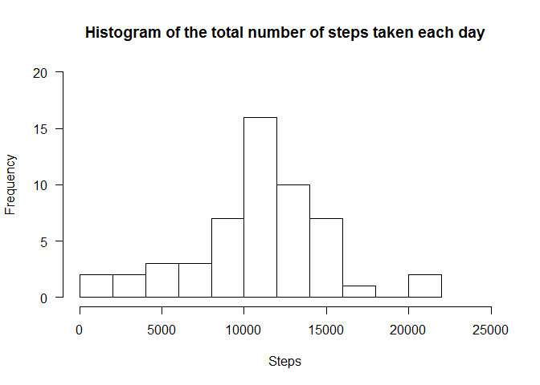
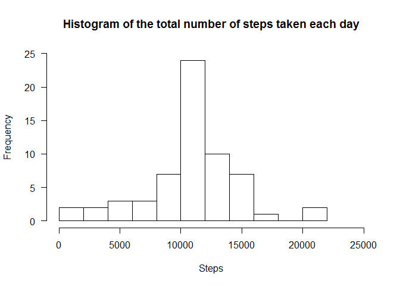

# Reproducible Research: Peer Assessment 1


## Loading and preprocessing the data

Here we're just going to read data from file 'activity.csv' to local variable:


```r
activity <- read.csv("activity.csv")
```


## What is mean total number of steps taken per day?

The following section calculates three things:

* Total number of steps taken per day
* Histogram of total number of steps taken eaxh day
* Mean and median of the total number of steps taken per day:


```r
library(dplyr)
dateAndSteps <- select(activity, c(date, steps))
stepsByDate <- aggregate(. ~ date, dateAndSteps, sum)
hist(stepsByDate$steps, main = "Histogram of the total number of steps taken each day", 
                        xlab = "Steps", 
                        las = 1, 
                        breaks = 10,
                        xlim = range(0, 25000),
                        ylim = range(0, 20))
```

 

```r
meanSteps <- mean(stepsByDate$steps)
medianSteps <- median(stepsByDate$steps)

print(meanSteps)
```

```
## [1] 10766.19
```

```r
print(medianSteps)
```

```
## [1] 10765
```

## What is the average daily activity pattern?

The following block addresses two tasks:

1. Make a time series plot of the 5-minute interval on x axis and the average number of steps taken, averaged across all days on the y axis
2. Figure out which 5-minute interval, on average across all the days in the dataset, contains the maximum number of steps


```r
meanStepsByInterval <- aggregate(. ~ interval, activity, mean)
plot(meanStepsByInterval$interval, meanStepsByInterval$steps, 
    type = "l",
    main = "Average number of steps taken by the 5-minute interval",
    xlab = "Interval",
    ylab = "Mean number of steps")
```

 

```r
maxPosition <- which.max(meanStepsByInterval$steps)
cat("The interval that has maximum numbers of steps is", meanStepsByInterval$interval[maxPosition])
```

```
## The interval that has maximum numbers of steps is 835
```


## Imputing missing values

Here we're going to investigate the NA values in the dataset.  
First of all we'll calculate the total number of lines containing NAs.
Then, we will substitute NAs with reasonable numbers(mean for that interval in this situation) thereby creating a new dataset.
Last, we'll create a histogram similar to those in first section, as well as calculate mean and median of total number of steps taken per day in the new dataset.


```r
numberOfNARows <- sum(apply(activity, 1, function(x) { sum(is.na(x)) > 0 }))
print (numberOfNARows)
```

```
## [1] 2304
```

```r
replaceNA <- function(x) {
    if (sum(is.na(x) > 0)) {
        x[is.na(x)] <- meanStepsByInterval[meanStepsByInterval$interval == as.integer(x[names(x) == "interval"]), ]$steps
    }
    return (x)
}

activityWithoutNA <- activity

for (i in 1:nrow(activity))
    activityWithoutNA[i, ] <- replaceNA(activity[i, ])


dateAndStepsWithoutNA <- select(activityWithoutNA, c(date, steps))
stepsByDateWithoutNA <- aggregate(. ~ date, dateAndStepsWithoutNA, sum)
hist(stepsByDateWithoutNA$steps, main = "Histogram of the total number of steps taken each day", 
                                 xlab = "Steps", 
                                 las = 1, 
                                 breaks = 10,
                                 xlim = range(0, 25000),
                                 ylim = range(0, 25))
```

 

```r
meanStepsWithoutNA <- mean(stepsByDateWithoutNA$steps)
medianStepsWithoutNA <- median(stepsByDateWithoutNA$steps)

print(meanStepsWithoutNA)
```

```
## [1] 10766.19
```

```r
print(medianStepsWithoutNA)
```

```
## [1] 10766.19
```

As we can see from the mean and median numbers - they don't change much. As well as the diagram, that remained almost the same.

## Are there differences in activity patterns between weekdays and weekends?

Now we'll explore the activity comparing weekdays and weekends.
First of all, let's add new variable to our dataset, containing "weekday" or "weekend" depending on date:


```r
data <- dateAndStepsWithoutNA
library(chron)
dayType <- as.factor(apply(data, 1, function(x) {
  if (is.weekend(as.Date(x[names(x) == "date"])))
    return ("weekend")
  else
    return ("weekday")
}))

data$dayType <- dayType 
data$interval <- activity$interval

weekends <- data[as.character(data$dayType) == "weekend", ]
weekdays <- data[as.character(data$dayType) == "weekday", ]

par(mfrow = c(2, 1), mar = c(2, 2, 2, 2))

makePlot <- function(data, xlab, ylab, main) {
  meanStepsByInterval <- aggregate(. ~ interval, data, mean)
  plot(meanStepsByInterval$interval, meanStepsByInterval$steps, 
    type = "l", xlab = xlab, ylab = ylab, main = main)
}

makePlot(weekends, "Interval", "Mean number of steps", "Average number of steps taken by the 5-minute interval")
makePlot(weekdays, "Interval", "Mean number of steps", "")
```

 
